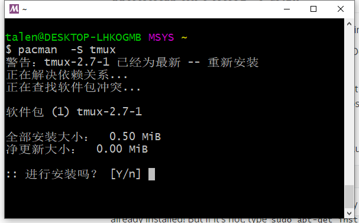

# 附录： tmux 在 Windows 10 使用{#appendix-windows-bash}

要在windows 系统上安装tmux，可以使用MSYS2，或者安装windows的子系统 Linux。

## 通过 MSYS2

下载安装  [MSYS2](http://www.msys2.org/)

```bash
pacman  -S tmux
```




## Window 的 Linux 子系统

从 Windows 10 build 14361开始，可以通过 Window 的 Linux 子系统 [运行 tmux](https://blogs.msdn.microsoft.com/commandline/2016/06/08/tmux-support-arrives-for-bash-on-ubuntu-on-windows/) 。

在 设置的 “Update & security”下的 "For Developers"，使能 **Developer mode** 选项。之后，打开 "Windows Features"。你可以在开始搜索 "Turn Windows features on or off"，然后打开 "Windows Subsystem for Linux (Beta)" 功能，需要重启电脑。

接下来打开 cmd窗口(Run cli.exe)，运行：

```bash
C:\Users\tony> bash.exe
```

可能需要同意一些条款，创建一个用户。在作者的电脑上，tmux已经安装好了。如果没有安装可以使用`sudo apt-get install tmux`安装。


```shell
yourusername@COMPUTERNAME-ID321FJ:/mnt/c/Users/username$ tmux
```


这下你可以在`bash.exe`里面运行tmux了。

在这个ubuntu系统里面，你可以通过 `sudo apt-get install **packagename**` 继续安装其他软件和`sudo apt-get update && sudo apt-get upgrade`更新软件。

